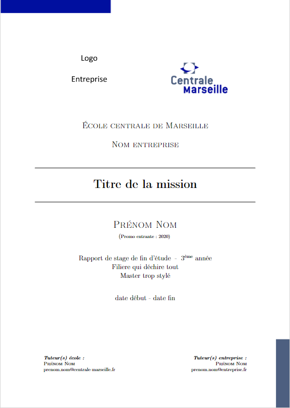

# Template LaTeX École centrale de Marseille

Ce template LaTeX est a destination des élèves de l'école centrale de Marseille afin qu'ils puissent rédiger leurs rapports de stages, alternance ...

Voici un petit aperçu de la page de garde. Vous pouvez voir le fichier complet en cliquant sur ``main.pdf``.

<p align="center">
  
</p>

## Installation

Pour utiliser ce template, plusieurs options s'offrent à vous :

- Télécharger le zip du projet (cliquer sur le bouton 'Code') pour ensuite l'importer dans Overleaf pour pouvoir travailler en ligne.
- Vous pouvez sinon télécharger le zip du projet et travailler en local sur votre machine si vous avez un compilateur LaTeX d'installer. Il vous suffira alors de "builder" le fichier  ``main.tex``.

## Utilisation

Voici les fichiers que vous allez pouvoir modifier :

- ``main.tex``, c'est la que va se toruver tout votre code correspondant au contenu de votre rapport.
- ``glossaire.tex``, ce glossaire va être inclus dans le rapport, vous pouvez l'enlever si nécessaire.
- ``annexes.tex``, c'est ici que vous allez écrire vos annexes, elles seront aussi insérées dans le rapport.
- ``main.bib``, il s'agit du fichier qui va contenir vos références bibliographiques qui pourront être appelées dans le document.

Le template comporte des ``\lipsum[...]``, cette commande sert à insérer du faux texte, pensez à les supprimer !

<b> Le code est normalement bien documenté pour que vous puissiez vous en sortir par vous-même. Si jamais voici quelques infomations supplmentaires.</b>

<hr>

### Informations sur le rapport

C'est là que vous allez renseigner toutes les informations vous concernant vous et votre stage (nom, prénom, titre de la mission ...)

### Images

Vous pourrez mettre vos images dans le dossier ``images``. Pour insérer l'image ``chien.png`` il faudra utiliser la commande :

```latex
\insererfigure{images/chien.jpg}{7cm}{Voici la photo de mon chien}{mon_chien}
```

(les paramètres dans l'ordre sont : le chemin vers l'image, la largeur de l'image, la légende à insérer sous l'image, le label qui servira à citer l'image)

(vous pouvez aussi spécifier `0.8\textwidth` à la place d'une longeur, ici l'image prendra 80% de la largeur (0.8))

### Ajout dans le sommaire

Quand vous utilisez une section étoilée (i.e. non numéotée) ``\section*{Section 2}``, celle-ci n'apparait dans la table des matières, il faut alors l'ajouter manuellement avec la commande suivante ``\ajoutsommaire{section}{Section 2}``, le premier paramètre correspondant au niveau du titre à ajouter (section, subsection ...) et le second au titre de la section.
